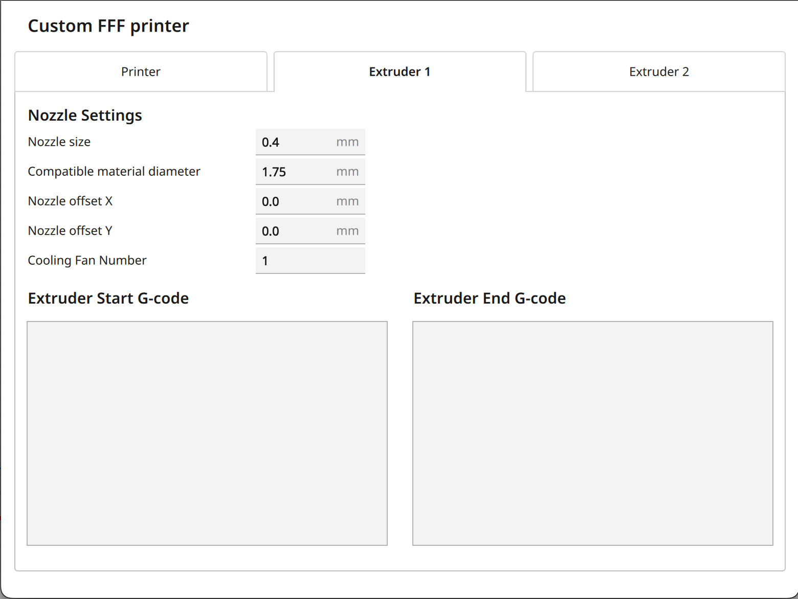

# Tenlog DMP Custom Profile Settings

These settings need to be entered in to a new Printer Profile

### Printer Settings

|                     |           |
| ------------------- | --------- |
| X                   | `305.0mm` |
| Y                   | `305.5mm` |
| Z                   | `350mm`   |
| Origin at Center    | `false`   |
| Heated Bed          | `true`    |
| Headed Build Volume | `false`   |
| G-code flavor       | `Marlin`  |

### Printhead Settings

|                                 |        |
| ------------------------------- | ------ |
| X min                           | `-75`  |
| Y min                           | `-18`  |
| X max                           | `18`   |
| Y max                           | `35`   |
| Gantry Height                   | `55mm` |
| Number of Extruders             | `2`    |
| Apply Extruder offsets to GCode | `true` |

Start Gcode:

```
G21 ;metric values
G90 ;absolute positioning
M82 ;set extruder to absolute mode
M107 ;start with the fan off
G28 ;Move to min endstops
G1 Z15.0 F9000 ;move the platform down 15mm
M117 Printing...
```

End Gcode

```
M104 T0 S0 ;1st extruder heater off
M104 T1 S0 ;2nd extruder heater off
M140 S0 ;heated bed heater off (if you have it)
G91 ;relative positioning
G1 E-1 F300  ;retract the filament a bit before lifting the nozzle, to release some of the pressure
G1 Z+0.5 E-5 X-20 Y-20 F9000 ;move Z up a bit and retract filament even more
G28 X0 Y0 ;move X/Y to min endstops, so the head is out of the way
M84 ;steppers off
G90 ;absolute positioning
```


### Extruder Settings

**Note**: Both extruders have the same settings.  
**ToDo**: Verify Fan settings should not change

|                              |        |
| ---------------------------- | ------ |
| Nozzle Size                  | `0.4`  |
| Compatible material diameter | `1.75` |
| Nozzle offset X              | `0.0`  |
| Nozzle offset Y              | `0.0`  |
| Cooling Fan Number           | `1`    |


